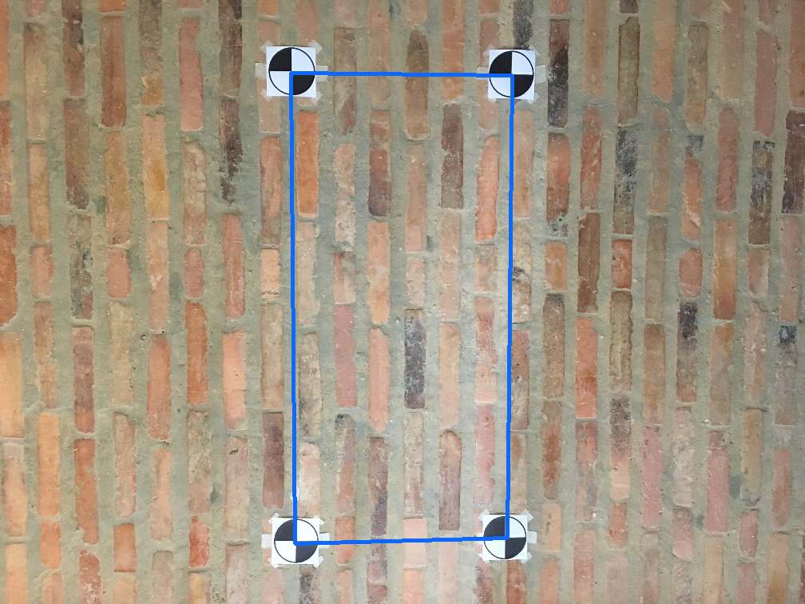

# Assignment 3: Introduction to Augmented Reality

## Objectives
  * `Find markers using circle and corner detection, convolution, and / or pattern recognition.`
  * `Learn how projective geometry can be used to transform a sample image from one plane to another.`
  * `Address the marker recognition problem when there is noise in the scene.`
  * `Implement backwards (reverse) warping.`
  * `Understand how video can be extracted in sequences of images, and replace specific areas of each
image with different content.`
  * `Assemble a video from a sequence of images.`
  
## Assignment Overview
In this assignment, the methods implemented utilize Feature Correspondence and
Corner detection; Perspective imaging; Projective geometry, Homographies, and Image Warping.

### Problem 1: Marker detection in a simulated scene
Identify markers for Augmented Reality exercise
<figure style="text-align: center">
    <b>AR Coordinates_1</b> \
</figure>

<figure style="text-align: center">
    <b>AR Coordinates_2</b> 
</figure>

<figure style="text-align: center">
    <b>AR Coordinates - noisy</b> 
</figure>

---
### Problem 2: Marker detection in a real scene
Identify markers in simulates scenes.
<figure style="text-align: center">
    <b>ps3-2-a-1</b>
    <figcaption><b> Marker Detection - Real Scene_1</b></figcaption>
</figure>

<figure style="text-align: center">
    <b>Marker Detection - Real Scene_2</b> 
</figure>

<figure style="text-align: center">
    <b>Marker Detection - Real Scene_3</b> 
</figure>

<figure style="text-align: center">
    <b>Marker Detection - Real Scene_4</b> 
</figure>

<figure style="text-align: center">
    <b>Marker Detection - Real Scene_5</b> 
</figure>

---
### Problem 3: Projective Geometry
#### Image Projection Technique
For my function “project_imageA_onto_imageB()”, I used a backward warping technique. 
In order to do so, before utilizing “remap”, I used an inversed homography and chose to  map pixels from my
destination image to pixels in my source image. I used matrix algebra to dot the inversed  homography with an
array of the indices based on the shape of the destination image, linearized. The shape of  the destination image is
necessary for the array as in order to map from the destination to the source.
When testing the function, I first tried performing the dot of the homography, not inverted,  with the array of
indices based on the shape of the source image. Then, I used “remap” , but as a result, pieces  of my source
image appeared in random locations in the destination image. 
The office hours video stressed the benefit of using backward warping, so after  struggling with forward warping,
I tried the techniques of inversing the homography and mapping from the destination  to the source.

Add the marketing image to background image. Match the marketing image to the background image's AR points.

<figure style="text-align: center">
    <b>Norman Borlaug_1</b> 
</figure>

<figure style="text-align: center">
    <b>Norman Borlaug_2</b> 
</figure>

<figure style="text-align: center">
    <b>Norman Borlaug_3</b> 
</figure>

---
### Problem 4: Finding markers in a video
Identify AR markers in the frames of a video.
<figure style="text-align: center">
    <b>Marker Detection - Real Video_1</b> 
</figure>
<figure style="text-align: center">
    <b>Marker Detection - Real Video_6</b> 
</figure>

Identify AR markers in the frames of a noisy video.
<figure style="text-align: center">
    <b>Marker Detection - Noisy-Real Video_2</b> 
</figure>
<figure style="text-align: center">
    <b>Marker Detection - Noisy-Real Scene_3</b> 
</figure>

---
### Problem 5: Final Augmented Reality
Adding an image to background video's frames. Match the image to the background video's AR points.
<figure style="text-align: center">
    <b>Image Projection onto Real Video_2</b> 
</figure>
<figure style="text-align: center">
    <b>Image Projection onto Real Video_4</b> 
</figure>

<figure style="text-align: center">
    <b>Image Projection onto Noisy-Real Video_2</b> 
</figure>
<figure style="text-align: center">
    <b>Image Projection onto Noisy-Real Video_3</b> 
</figure>

---
### Challenge Problem: Video in Video
Nest a video in the video with AR markers.

<figure style="text-align: center">
    <b>Nested Video in Video</b> 
</figure>

---
### Challenge Problem: Tracking corners with ArUco Markers
Adding an image to background image's frames. Match the image to the background image's ArUco markers.

[//]: # ([Cookie in ArUco]&#40;output/ps3-7-out.mp4&#41;)